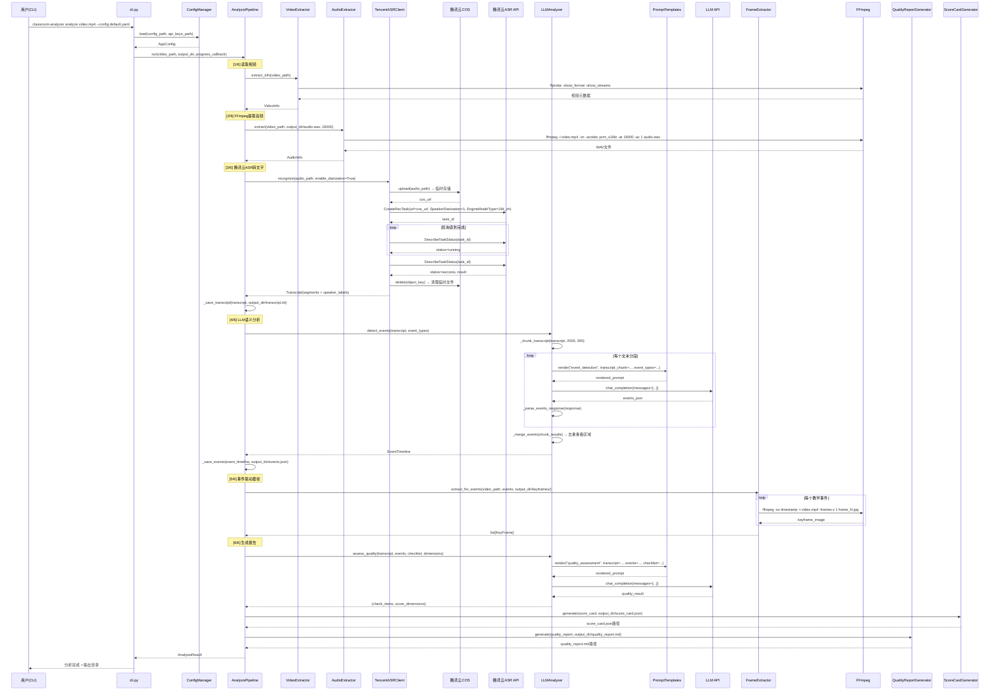
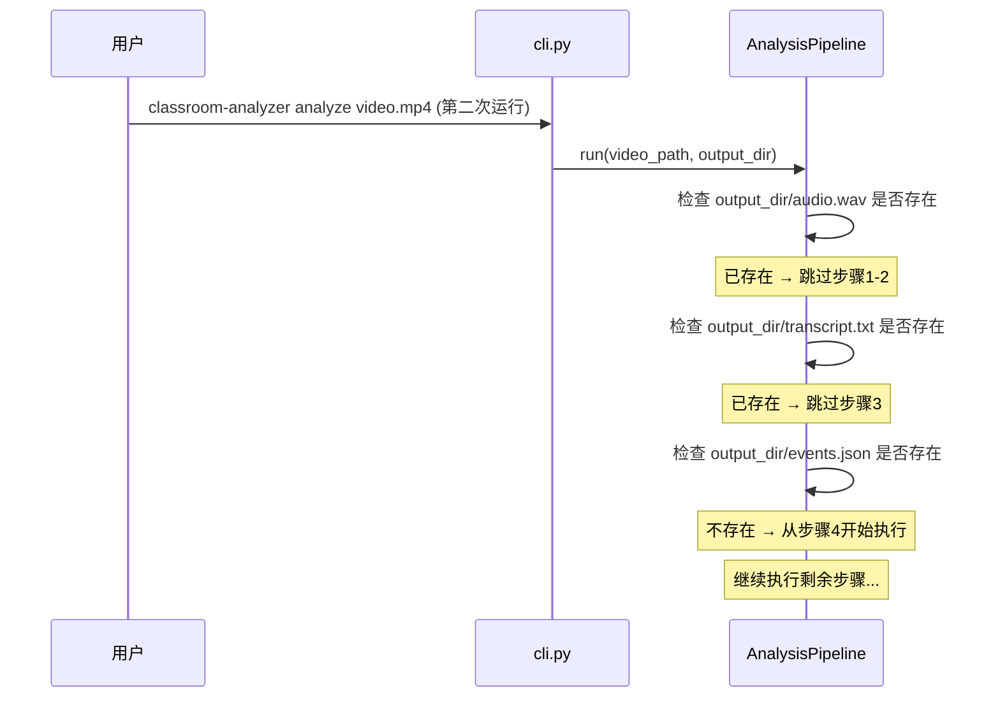
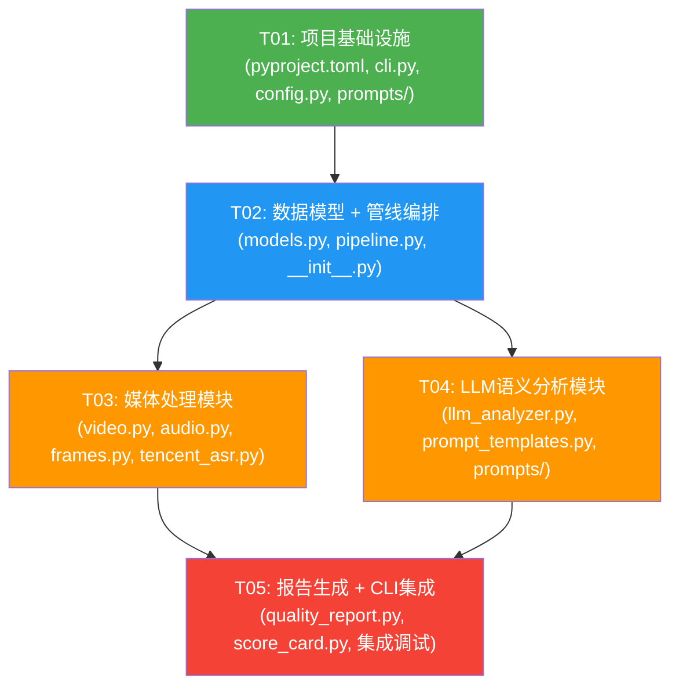

# 课堂视频智能分析工具 — 系统架构设计文档

> 架构师：高见远（Gao） | 版本：v1.0 | 日期：2026-06-03

---

## 1. 实现方案与框架选型

### 1.1 核心技术挑战

| 挑战 | 说明 | 应对策略 |
|------|------|---------|
| 大文件视频处理 | 单文件几百MB~1GB，纯CPU环境 | FFmpeg流式处理，不加载整个文件到内存 |
| 长音频ASR识别 | 40~60分钟音频，需说话人分离 | 腾讯云录音文件识别API（异步任务+轮询），音频上传至COS获取URL |
| LLM长文本处理 | 转录文本可达3万+字，超LLM上下文窗口 | 滑动窗口分段分析，重叠边界防事件遗漏 |
| 事件驱动截帧精度 | 教学事件需映射回视频时间戳 | 基于ASR时间戳+LLM事件时间，FFmpeg精确seek截帧 |
| Windows环境兼容 | FFmpeg路径、子进程编码、文件路径分隔符 | 统一使用Path对象，FFmpeg路径可配置，subprocess统一编码 |
| Prompt校准迭代 | 教学事件识别准确率依赖Prompt质量 | Prompt外部化为Markdown文件，支持版本管理和A/B测试 |

### 1.2 架构模式

**Pipeline（管线）模式**：核心处理流程设计为6阶段串行管线，每阶段输入输出明确，便于独立测试和错误定位。

```
┌──────────┐   ┌──────────┐   ┌──────────┐   ┌──────────┐   ┌──────────┐   ┌──────────┐
│ 视频读取  │──▶│ 音频提取  │──▶│ ASR转写   │──▶│ LLM分析   │──▶│ 事件截帧  │──▶│ 报告生成  │
└──────────┘   └──────────┘   └──────────┘   └──────────┘   └──────────┘   └──────────┘
```

关键设计决策：
- **阶段可恢复**：每阶段完成后持久化中间结果到输出目录，失败后可从断点恢复
- **事件驱动而非轮询驱动**：截帧时机由语义分析结果决定，非固定间隔
- **配置即策略**：评分标准、质检清单、事件类型全部YAML配置化

### 1.3 框架与库选型

| 类别 | 选型 | 版本 | 选型理由 |
|------|------|------|---------|
| CLI框架 | Click | ≥8.1 | Python CLI标准库，装饰器语法简洁，自动生成帮助文档 |
| 终端UI | Rich | ≥13.0 | 进度条、表格、高亮输出，CLI体验优秀 |
| FFmpeg调用 | subprocess（标准库） | - | 直接调用ffmpeg命令行，避免ffmpeg-python的抽象泄漏和兼容性问题 |
| 腾讯云ASR | tencentcloud-sdk-python | ≥3.0 | 官方SDK，CreateRecTask/DescribeTaskStatus API |
| 腾讯云COS | cos-python-sdk-v5 | ≥1.9 | ASR需URL方式提交长音频，COS用于临时上传音频文件 |
| LLM调用 | openai | ≥1.0 | OpenAI兼容API客户端，支持GPT/Claude/DeepSeek/Qwen等 |
| Prompt模板 | Jinja2 | ≥3.1 | 成熟的模板引擎，支持条件/循环/继承，适合Prompt组合 |
| 配置解析 | PyYAML | ≥6.0 | YAML配置文件解析标准库 |
| 日志 | loguru | ≥0.7 | 零配置开箱即用，结构化日志，异常追踪完整 |
| 数据模型 | dataclasses（标准库） | - | 轻量级，无额外依赖，Python 3.13原生支持 |
| 测试 | pytest | ≥8.0 | Python测试标准框架，fixture灵活 |

### 1.4 关键设计决策

#### D1: ASR音频提交方式 — COS中转

腾讯云录音文件识别API（CreateRecTask）要求音频以URL方式提交（SourceType=0），Base64方式限制5MB无法满足长音频需求。因此设计为：

```
本地WAV → 上传COS → 获取临时URL → CreateRecTask(URL) → 识别完成后删除COS文件
```

- COS Bucket配置写入api_keys.json
- 上传后生成预签名URL（有效期1小时）
- 识别完成后自动清理COS临时文件

#### D2: LLM分析 — 滑动窗口分段

转录文本可能超过LLM上下文窗口。采用滑动窗口策略：
- 每段约2000字（约5分钟语音）
- 相邻段重叠200字（防边界事件遗漏）
- 每段独立调用LLM，最后合并去重（基于时间戳去重重叠区域事件）

#### D3: 评分机制 — LLM评估 + 加权计算

评分由两步完成：
1. **LLM评估**：将转录文本、事件时间轴、评分维度送入LLM，输出每个维度的分数(0-100)和证据
2. **加权计算**：按配置权重加权求和，生成总分

这样评分既有AI理解能力，又保持配置化的可校准性。

#### D4: 管线断点恢复

每阶段完成后将中间结果写入输出目录：
- `audio.wav` — 提取的音频文件
- `transcript.txt` — ASR转写结果
- `events.json` — LLM分析的教学事件

重跑时检测已有中间结果，跳过已完成阶段（可通过`--force`强制重跑）。

---

## 2. 文件列表及相对路径

```
classroom_video_analyzer/
├── pyproject.toml                              # 项目配置 + 依赖声明 + 入口点
├── config/
│   ├── api_keys.json                           # API密钥配置（gitignored）
│   ├── api_keys.json.template                  # API密钥模板
│   └── default.yaml                            # 默认评分标准配置
├── docs/
│   ├── PRD.md                                  # 产品需求文档
│   ├── ARCHITECTURE.md                         # 本文档
│   ├── class-diagram.mermaid                   # 类图
│   └── sequence-diagram.mermaid                # 时序图
├── prompts/
│   ├── event_detection.md                      # 教学事件识别Prompt模板
│   └── quality_assessment.md                   # 质量评估+评分Prompt模板
├── src/
│   └── classroom_analyzer/
│       ├── __init__.py                         # 包初始化 + 版本号
│       ├── __main__.py                         # python -m入口
│       ├── cli.py                              # Click CLI定义
│       ├── config.py                           # 配置加载与校验
│       ├── models.py                           # 核心数据模型（dataclasses）
│       ├── pipeline.py                         # 分析管线编排器
│       ├── extractors/
│       │   ├── __init__.py                     # 模块导出
│       │   ├── video.py                        # 视频信息提取（ffprobe）
│       │   ├── audio.py                        # FFmpeg音频提取
│       │   └── frames.py                       # 事件驱动FFmpeg截帧
│       ├── asr/
│       │   ├── __init__.py                     # 模块导出
│       │   └── tencent_asr.py                  # 腾讯云ASR客户端（含COS上传）
│       ├── analysis/
│       │   ├── __init__.py                     # 模块导出
│       │   ├── llm_analyzer.py                 # LLM语义分析器
│       │   └── prompt_templates.py             # Prompt模板加载与渲染
│       └── reports/
│           ├── __init__.py                     # 模块导出
│           ├── quality_report.py               # 质检报告生成器（Markdown）
│           └── score_card.py                   # 评分卡生成器（JSON）
└── tests/
    ├── __init__.py
    ├── conftest.py                             # 共享测试fixtures
    ├── test_config.py                          # 配置加载测试
    ├── test_models.py                          # 数据模型测试
    ├── test_extractors.py                      # 媒体处理测试
    ├── test_asr.py                             # ASR客户端测试
    ├── test_analysis.py                        # LLM分析测试
    └── test_reports.py                         # 报告生成测试
```

**文件总数**：28个（含4个已有文件：README.md, api_keys.json, api_keys.json.template, PRD.md）

---

## 3. 数据结构与接口（类图）

```mermaid
classDiagram
    direction TB

    class VideoInfo {
        +str file_path
        +int file_size
        +float duration
        +str format
        +tuple~int,int~ resolution
    }

    class AudioInfo {
        +str file_path
        +float duration
        +int sample_rate
        +int channels
        +str format
    }

    class TranscriptSegment {
        +float start_time
        +float end_time
        +str text
        +str speaker
    }

    class Transcript {
        +list~TranscriptSegment~ segments
        +float duration
        +int speaker_count
        +to_text() str
        +get_segments_by_speaker(speaker: str) list~TranscriptSegment~
        +get_segments_in_range(start: float, end: float) list~TranscriptSegment~
    }

    class TeachingEvent {
        +str event_type
        +str subtype
        +float start_time
        +float end_time
        +str description
        +float confidence
        +str related_text
    }

    class EventTimeline {
        +list~TeachingEvent~ events
        +get_events_by_type(event_type: str) list~TeachingEvent~
        +get_events_in_range(start: float, end: float) list~TeachingEvent~
        +to_json() str
    }

    class KeyFrame {
        +str file_path
        +float timestamp
        +TeachingEvent trigger_event
    }

    class QualityCheckItem {
        +str description
        +bool passed
        +str evidence
        +float|None timestamp
    }

    class ScoreDimension {
        +str name
        +float score
        +float max_score
        +float weight
        +str evidence
        +str details
    }

    class ScoreCard {
        +list~ScoreDimension~ dimensions
        +float total_score
        +float total_max
        +to_json() str
    }

    class QualityReport {
        +VideoInfo video_info
        +str transcript_summary
        +list~QualityCheckItem~ check_items
        +dict event_summary
        +ScoreCard score_card
        +to_markdown() str
    }

    class AnalysisResult {
        +VideoInfo video_info
        +AudioInfo audio_info
        +Transcript transcript
        +EventTimeline event_timeline
        +list~KeyFrame~ keyframes
        +QualityReport quality_report
        +ScoreCard score_card
        +str output_dir
    }

    class ScoringDimensionConfig {
        +str name
        +float weight
        +str criteria
    }

    class AppConfig {
        +list~ScoringDimensionConfig~ scoring_dimensions
        +list~str~ quality_checklist
        +list~str~ event_types
        +dict api_keys
        +dict asr_config
        +dict analysis_config
        +dict cos_config
    }

    Transcript "1" *-- "many" TranscriptSegment : contains
    EventTimeline "1" *-- "many" TeachingEvent : contains
    QualityReport "1" *-- "1" ScoreCard : contains
    QualityReport "1" *-- "many" QualityCheckItem : contains
    ScoreCard "1" *-- "many" ScoreDimension : contains
    AnalysisResult "1" *-- "1" VideoInfo : has
    AnalysisResult "1" *-- "1" AudioInfo : has
    AnalysisResult "1" *-- "1" Transcript : has
    AnalysisResult "1" *-- "1" EventTimeline : has
    AnalysisResult "1" *-- "many" KeyFrame : has
    AnalysisResult "1" *-- "1" QualityReport : has
    AnalysisResult "1" *-- "1" ScoreCard : has
    AppConfig "1" *-- "many" ScoringDimensionConfig : defines
    KeyFrame "many" --> "1" TeachingEvent : triggered_by

    class ConfigManager {
        +__init__(config_path: str, api_keys_path: str)
        +load() AppConfig
        +validate() bool
    }

    class VideoExtractor {
        +extract_info(file_path: str)$ VideoInfo
        +validate_format(file_path: str)$ bool
        -_run_ffprobe(file_path: str)$ dict
    }

    class AudioExtractor {
        +str ffmpeg_path
        +__init__(ffmpeg_path: str)
        +extract(video_path: str, output_path: str, sample_rate: int) AudioInfo
        -_build_extract_cmd(video_path: str, output_path: str, sample_rate: int) list
    }

    class FrameExtractor {
        +str ffmpeg_path
        +__init__(ffmpeg_path: str)
        +extract_at_timestamp(video_path: str, timestamp: float, output_dir: str, frame_name: str) str
        +extract_for_events(video_path: str, events: list~TeachingEvent~, output_dir: str) list~KeyFrame~
        -_build_frame_cmd(video_path: str, timestamp: float, output_path: str) list
    }

    class TencentASRClient {
        +str secret_id
        +str secret_key
        +dict cos_config
        +__init__(secret_id: str, secret_key: str, cos_config: dict)
        +recognize(audio_path: str, enable_diarization: bool) Transcript
        -_upload_to_cos(local_path: str) str
        -_create_task(audio_url: str, enable_diarization: bool) int
        -_poll_task(task_id: int, timeout: int) dict
        -_parse_result(raw_result: dict) Transcript
        -_cleanup_cos(object_key: str)
    }

    class LLMAnalyzer {
        +str api_key
        +str model
        +str base_url
        +__init__(api_key: str, model: str, base_url: str)
        +detect_events(transcript: Transcript, event_types: list~str~) EventTimeline
        +assess_quality(transcript: Transcript, events: EventTimeline, checklist: list~str~, dimensions: list~ScoringDimensionConfig~) tuple
        -_chunk_transcript(transcript: Transcript, chunk_size: int, overlap: int) list~str~
        -_merge_events(chunk_results: list) EventTimeline
        -_call_llm(messages: list~dict~) str
        -_parse_events_response(response: str) list~TeachingEvent~
        -_parse_quality_response(response: str) tuple
    }

    class PromptTemplates {
        +str prompts_dir
        +__init__(prompts_dir: str)
        +load(name: str) str
        +render(name: str, **kwargs) str
    }

    class QualityReportGenerator {
        +generate(report: QualityReport, output_path: str) str
        -_format_check_items(items: list~QualityCheckItem~) str
        -_format_event_summary(summary: dict) str
    }

    class ScoreCardGenerator {
        +generate(score_card: ScoreCard, output_path: str) str
    }

    class AnalysisPipeline {
        +AppConfig config
        +__init__(config: AppConfig)
        +run(video_path: str, output_dir: str, progress_callback: Callable) AnalysisResult
        +run_step(step: int, video_path: str, output_dir: str) Any
        -_step_read_video(video_path: str) VideoInfo
        -_step_extract_audio(video_path: str, output_dir: str) AudioInfo
        -_step_asr(audio_path: str) Transcript
        -_step_llm_analysis(transcript: Transcript) EventTimeline
        -_step_extract_frames(video_path: str, events: EventTimeline, output_dir: str) list~KeyFrame~
        -_step_generate_reports(transcript: Transcript, events: EventTimeline, output_dir: str) tuple
        -_save_transcript(transcript: Transcript, output_path: str)
        -_save_events(events: EventTimeline, output_path: str)
    }

    ConfigManager --> AppConfig : creates
    AnalysisPipeline --> ConfigManager : uses
    AnalysisPipeline --> VideoExtractor : uses
    AnalysisPipeline --> AudioExtractor : uses
    AnalysisPipeline --> FrameExtractor : uses
    AnalysisPipeline --> TencentASRClient : uses
    AnalysisPipeline --> LLMAnalyzer : uses
    AnalysisPipeline --> QualityReportGenerator : uses
    AnalysisPipeline --> ScoreCardGenerator : uses
    LLMAnalyzer --> PromptTemplates : uses
    TencentASRClient ..> Transcript : produces
    LLMAnalyzer ..> EventTimeline : produces
```



---

## 4. 程序调用流程（时序图）

### 4.1 核心分析管线完整流程



### 4.2 断点恢复流程



---

## 5. 任务列表

### 5.1 依赖包列表

```
- click>=8.1.0              : CLI框架，装饰器式命令定义
- rich>=13.0.0              : 终端美化输出，进度条，表格
- pyyaml>=6.0               : YAML配置文件解析
- loguru>=0.7.0             : 结构化日志，零配置
- openai>=1.0.0             : OpenAI兼容LLM API客户端
- jinja2>=3.1.0             : Prompt模板渲染引擎
- tencentcloud-sdk-python>=3.0.0 : 腾讯云SDK（ASR API调用）
- cos-python-sdk-v5>=1.9.0  : 腾讯云COS SDK（音频文件上传）
- pytest>=8.0.0             : 测试框架（开发依赖）
- pytest-mock>=3.12.0       : Mock支持（开发依赖）
```

### 5.2 任务分解

---

#### T01: 项目基础设施

**描述**：搭建项目骨架，包括依赖声明、包结构、入口文件、CLI框架、配置加载、Prompt模板文件

**源文件**：
- `pyproject.toml` — 项目元数据、依赖、入口点声明
- `src/classroom_analyzer/__init__.py` — 包初始化、版本号
- `src/classroom_analyzer/__main__.py` — `python -m` 入口
- `src/classroom_analyzer/cli.py` — Click CLI定义（analyze命令骨架）
- `src/classroom_analyzer/config.py` — 配置加载与校验
- `config/default.yaml` — 默认评分标准YAML配置
- `config/api_keys.json.template` — API密钥模板（更新，增加COS配置）
- `prompts/event_detection.md` — 教学事件识别Prompt初始模板
- `prompts/quality_assessment.md` — 质量评估Prompt初始模板

**依赖**：无

**优先级**：P0

**预估复杂度**：中

**验收标准**：
- `pip install -e .` 成功安装
- `classroom-analyzer --help` 输出帮助信息
- `classroom-analyzer analyze --help` 输出子命令帮助
- ConfigManager能正确加载和校验default.yaml
- api_keys.json.template包含COS bucket配置项

---

#### T02: 数据模型 + 管线编排

**描述**：定义所有核心数据结构（dataclasses），实现管线编排器框架，定义各模块的`__init__.py`导出

**源文件**：
- `src/classroom_analyzer/models.py` — 所有数据模型
- `src/classroom_analyzer/pipeline.py` — 管线编排器（6步骤骨架+断点恢复逻辑）
- `src/classroom_analyzer/extractors/__init__.py` — 模块导出
- `src/classroom_analyzer/asr/__init__.py` — 模块导出
- `src/classroom_analyzer/analysis/__init__.py` — 模块导出
- `src/classroom_analyzer/reports/__init__.py` — 模块导出
- `tests/conftest.py` — 共享测试fixtures
- `tests/test_models.py` — 数据模型单元测试

**依赖**：T01

**优先级**：P0

**预估复杂度**：高

**验收标准**：
- 所有dataclass定义完整，类型注解正确
- AnalysisPipeline.run()骨架可调用，6步骤有清晰的接口定义
- 断点恢复逻辑：检测已有中间文件跳过对应步骤
- models.py的单元测试通过
- 各模块__init__.py正确导出

---

#### T03: 媒体处理模块

**描述**：实现视频信息提取、FFmpeg音频提取、事件驱动截帧、腾讯云ASR客户端（含COS上传）

**源文件**：
- `src/classroom_analyzer/extractors/video.py` — ffprobe视频信息提取
- `src/classroom_analyzer/extractors/audio.py` — FFmpeg音频提取
- `src/classroom_analyzer/extractors/frames.py` — 事件驱动FFmpeg截帧
- `src/classroom_analyzer/asr/tencent_asr.py` — 腾讯云ASR客户端（COS上传+CreateRecTask+轮询+结果解析）
- `tests/test_extractors.py` — 媒体处理测试
- `tests/test_asr.py` — ASR客户端测试

**依赖**：T01, T02

**优先级**：P0

**预估复杂度**：高

**验收标准**：
- VideoExtractor能从mp4文件提取时长、分辨率、格式等信息
- AudioExtractor能从视频提取16kHz单声道WAV
- FrameExtractor能按指定时间戳精确截帧
- TencentASRClient能完成COS上传→CreateRecTask→轮询→结果解析全流程
- 说话人分离功能正确启用（SpeakerDiarization=1）
- Windows环境下FFmpeg路径处理正确
- COS临时文件在识别完成后清理

---

#### T04: LLM语义分析模块

**描述**：实现Prompt模板管理、LLM客户端封装、教学事件识别、质量评估与评分

**源文件**：
- `src/classroom_analyzer/analysis/prompt_templates.py` — Prompt模板加载与Jinja2渲染
- `src/classroom_analyzer/analysis/llm_analyzer.py` — LLM客户端、滑动窗口分段、事件检测、质量评估
- `prompts/event_detection.md` — 完善事件识别Prompt（由T01创建骨架，本任务完善内容）
- `prompts/quality_assessment.md` — 完善质量评估Prompt（由T01创建骨架，本任务完善内容）
- `tests/test_analysis.py` — LLM分析测试

**依赖**：T01, T02

**优先级**：P0

**预估复杂度**：高

**验收标准**：
- PromptTemplates能加载Markdown模板并用Jinja2渲染变量
- LLMAnalyzer支持滑动窗口分段长转录文本（2000字/段，200字重叠）
- detect_events()输出结构化EventTimeline（6大类事件正确识别）
- assess_quality()输出QualityCheckItem列表和ScoreDimension列表
- LLM返回的JSON能正确解析，异常格式有容错处理
- API调用有重试机制（指数退避，最多3次）

---

#### T05: 报告生成 + CLI集成

**描述**：实现质检报告Markdown生成、评分卡JSON生成、管线完整集成、CLI完整交互

**源文件**：
- `src/classroom_analyzer/reports/quality_report.py` — 质检报告Markdown生成
- `src/classroom_analyzer/reports/score_card.py` — 评分卡JSON生成
- `src/classroom_analyzer/cli.py` — 完善CLI（Rich进度条、错误处理、输出展示）
- `src/classroom_analyzer/pipeline.py` — 完善管线集成（接入T03/T04的实际实现）
- `tests/test_reports.py` — 报告生成测试
- `tests/test_config.py` — 配置加载测试

**依赖**：T01, T02, T03, T04

**优先级**：P0

**预估复杂度**：中

**验收标准**：
- 质检报告Markdown格式与PRD样例一致
- 评分卡JSON格式包含维度名称、分数、满分、权重、证据
- CLI展示6步骤进度条（Rich Progress）
- 完整管线端到端跑通：`classroom-analyzer analyze video.mp4 --config default.yaml`
- 输出目录结构符合PRD定义
- 断点恢复正常工作
- 错误情况有友好的错误提示

---

### 5.3 任务依赖图



**关键路径**：T01 → T02 → T03 → T05（或 T01 → T02 → T04 → T05）

**并行机会**：T03和T04可并行开发（均仅依赖T01和T02）

---

## 6. 共享知识（跨文件约定）

### 6.1 编码规范

```
- Python版本：3.13+，使用type hints
- 字符串：所有用户可见字符串使用中文，代码标识符使用英文
- 路径处理：统一使用 pathlib.Path，禁止字符串拼接路径
- 子进程：所有subprocess调用设置encoding='utf-8', errors='replace'
- 日志：使用loguru，logger = loguru.logger，关键步骤记录INFO，调试记录DEBUG
- 异常：自定义异常类继承自 ClassroomAnalyzerError，不裸抛Exception
- 数据模型：所有数据模型使用@dataclass，不可变字段使用frozen=True
```

### 6.2 时间戳约定

```
- 内部时间戳统一使用秒（float），如 125.5 表示 2分05秒
- 面向用户展示格式：MM:SS（如 02:05）
- ASR返回的毫秒时间戳在解析时转换为秒
- FFmpeg的 -ss 参数接受秒数
```

### 6.3 文件命名约定

```
- 输出目录命名：{video_stem}_{YYYYMMDD}/（如 lesson_20260601/）
- 关键帧命名：frame_{event_type}_{timestamp:.0f}.jpg（如 frame_interaction_125.jpg）
- 中间文件：audio.wav, transcript.txt, events.json
- 最终报告：quality_report.md, score_card.json
```

### 6.4 API调用约定

```
- LLM API：使用OpenAI兼容接口，base_url可配置
- 腾讯云ASR：EngineModelType默认16k_zh，ResTextFormat=3（带标点断句）
- 说话人分离：SpeakerDiarization=1, SpeakerNumber=0（自动检测）
- 重试策略：指数退避，初始1秒，最大3次重试
- 超时设置：ASR轮询间隔10秒，单次轮询超时5分钟；LLM调用超时60秒
```

### 6.5 配置文件约定

```
- 评分配置：YAML格式，路径通过--config指定，默认config/default.yaml
- API密钥：JSON格式，路径固定为config/api_keys.json（gitignored）
- Prompt模板：Markdown格式，存放在prompts/目录，使用Jinja2语法插入变量
- 所有配置文件使用UTF-8编码
```

### 6.6 输出格式约定

```
- transcript.txt：每行格式 "[MM:SS-MM:SS] speaker: text"
- events.json：JSON数组，每个元素包含 event_type, subtype, start_time, end_time, description, confidence
- quality_report.md：Markdown格式，与PRD样例一致
- score_card.json：JSON对象，包含dimensions数组和total_score
```

---

## 7. 待明确事项

| 编号 | 事项 | 影响范围 | 建议处理方式 |
|------|------|---------|------------|
| A1 | **COS Bucket配置**：ASR需URL方式提交音频，需提前创建COS Bucket并配置权限 | tencent_asr.py, api_keys.json | 在api_keys.json中增加cos_config字段（bucket, region, path_prefix）；MVP使用专用Bucket，生命周期策略自动清理 |
| A2 | **FFmpeg安装方式**：Windows环境下FFmpeg需预装或项目内携带 | audio.py, frames.py, video.py | 优先从系统PATH查找ffmpeg/ffprobe；未找到时提示安装指引；可考虑在pyproject.toml中声明ffmpeg-python依赖作为备选 |
| A3 | **LLM提供商确定**：OpenAI API兼容格式支持多家，需确定默认模型 | llm_analyzer.py, api_keys.json | api_keys.json中配置base_url和model_name；默认使用DeepSeek（性价比高，中文能力强）；通过环境变量可切换 |
| A4 | **ASR引擎选择**：16k_zh vs 16k_zh_large | tencent_asr.py | MVP使用16k_zh（成本低）；16k_zh_large作为配置可选项，对低质量音频效果更好但价格更高 |
| A5 | **齐答/多人同时说话的降级策略**：说话人分离在多人同时说话时可能失效 | tencent_asr.py, llm_analyzer.py | MVP阶段：ASR无法区分时标记为"speaker_unknown"；LLM分析时根据语义判断是集体回答还是个人回答 |
| A6 | **评分校准样本数**：Prompt调优需要多少样本视频 | prompts/ | 建议准备5-10节不同类型课堂视频作为校准集；Prompt模板需版本化迭代 |
| A7 | **ASR音频格式**：WAV vs MP3 | audio.py | 提取WAV（16kHz单声道PCM）最兼容；如音频过大可转为MP3降低上传时间，但需确认ASR兼容性 |
| A8 | **COS地域选择**：COS Bucket地域影响上传速度和ASR访问延迟 | api_keys.json | 建议COS与ASR同一地域（如ap-guangzhou）；减少跨地域传输延迟 |

---

## 附录：API密钥配置模板（更新版）

api_keys.json.template 建议更新为：

```json
{
  "tencent_cloud": {
    "secret_id": "在这里粘贴你的SecretId",
    "secret_key": "在这里粘贴你的SecretKey"
  },
  "cos": {
    "bucket": "your-bucket-name-1234567890",
    "region": "ap-guangzhou",
    "path_prefix": "asr-upload/"
  },
  "asr": {
    "engine": "16k_zh",
    "language": "zh",
    "enable_diarization": true,
    "speaker_number": 0
  },
  "llm": {
    "base_url": "https://api.deepseek.com/v1",
    "api_key": "在这里粘贴你的LLM API Key",
    "model": "deepseek-chat"
  },
  "analysis": {
    "chunk_size": 2000,
    "chunk_overlap": 200,
    "smart_sampling": true
  }
}
```
