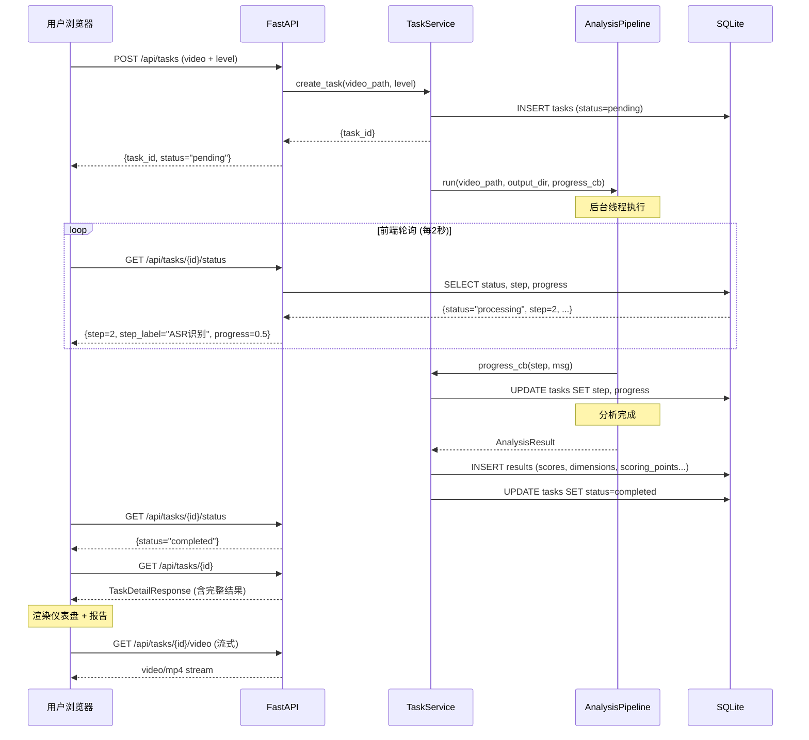
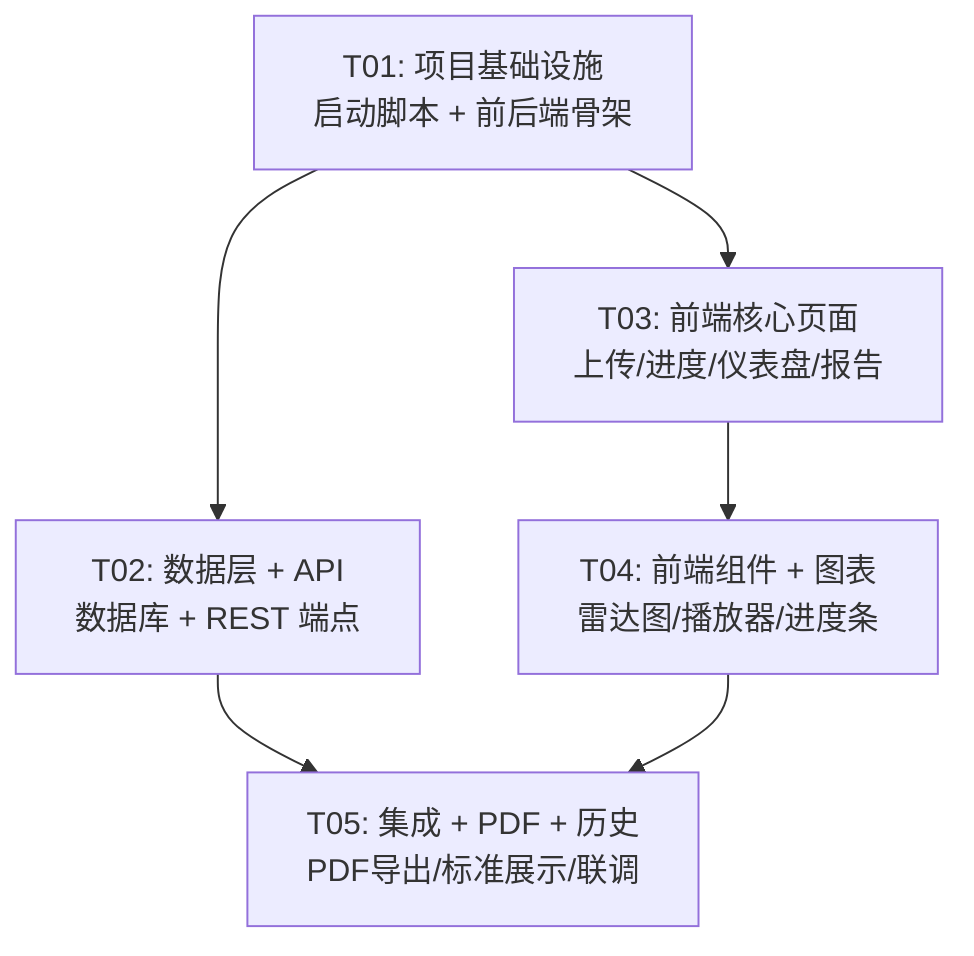

# 火花课堂视频分析 Web 工具 — 系统设计

> 架构师：高见远 | 版本：v2.0-Web | 日期：2026-06-03

---

## 1. 实现方案概述

在现有 Python CLI 分析管线之上，新增 **FastAPI 后端**包装管线为 REST API（后台线程执行长任务），新增 **React SPA 前端**提供上传→进度→报告全流程可视化。前后端同源部署，双击 `start.bat` 一键启动。

## 2. 框架选型

| 层 | 选型 | 理由 |
|---|---|---|
| 后端 | **FastAPI** + uvicorn | Python 生态，直接 import 现有 pipeline.py；原生 async；自动 OpenAPI |
| 前端 | **Vite + React 18 + MUI 5 + Tailwind CSS** | 默认技术栈，MUI 组件丰富 |
| 图表 | **Recharts** | React 雷达图首选，声明式 API |
| PDF | **WeasyPrint** | Python 端 HTML→PDF，复用报告模板 |
| 数据库 | **SQLite** + aiosqlite | 用户确认，单机无需重型 DB |
| 视频播放 | **video.js** | 支持片段 seek，`@timestamp` 跳转核心需求 |

## 3. Web 项目文件结构

```
classroom-video-analyzer/
├── start.bat                          # 一键启动脚本
├── start.sh                           # macOS/Linux 启动脚本
├── data/                              # SQLite + 上传视频存储
│   └── app.db
├── src/classroom_analyzer/            # 现有 Python 模块（不改动）
│   ├── server/                        # ★ 新增：FastAPI 后端
│   │   ├── __init__.py
│   │   ├── app.py                     # FastAPI 应用入口 + 生命周期
│   │   ├── database.py                # SQLite 建表 + CRUD
│   │   ├── models.py                  # Pydantic 请求/响应模型
│   │   ├── routers/
│   │   │   ├── __init__.py
│   │   │   ├── tasks.py               # 任务 CRUD + 上传 + 进度
│   │   │   ├── reports.py             # 报告详情 + PDF 下载
│   │   │   └── standards.py           # 评价标准查询
│   │   ├── services.py                # 管线调用 + 后台任务管理
│   │   └── pdf_generator.py           # WeasyPrint PDF 生成
│   └── ...
├── web/                               # ★ 新增：React 前端
│   ├── package.json
│   ├── vite.config.ts
│   ├── tailwind.config.ts
│   ├── tsconfig.json
│   ├── index.html
│   └── src/
│       ├── main.tsx                   # 入口
│       ├── App.tsx                    # 路由 + 布局
│       ├── api/
│       │   └── client.ts              # fetch 封装，统一错误处理
│       ├── types/
│       │   └── index.ts               # TypeScript 类型定义
│       ├── pages/
│       │   ├── UploadPage.tsx         # 上传 + 班型选择 + 开始分析
│       │   ├── ProgressPage.tsx       # 四阶段进度条 + 实时状态
│       │   ├── DashboardPage.tsx      # 雷达图 + 总分 + 等级 + 红线
│       │   ├── ReportPage.tsx         # 详细文字报告 + 视频跳转
│       │   ├── HistoryPage.tsx        # 历史记录列表 + 搜索
│       │   └── StandardsPage.tsx      # QC-v4 评价标准展示
│       └── components/
│           ├── RadarChart.tsx         # 10维雷达图
│           ├── ScoreCard.tsx          # 总分卡片 + 等级徽章
│           ├── RedLineAlert.tsx       # 红线一票否决提示
│           ├── StepProgress.tsx       # 四阶段进度条
│           ├── VideoPlayer.tsx        # video.js 播放器 + 时间戳跳转
│           └── ScoringPointList.tsx   # scoring_points 列表 + 时间戳链接
└── config/default.yaml                # 现有配置（不改动）
```

## 4. 后端 API 设计

| 方法 | 端点 | 说明 | 请求/响应 |
|------|------|------|----------|
| POST | `/api/tasks` | 上传视频创建任务 | multipart: video + level → `{task_id, status}` |
| GET | `/api/tasks` | 历史列表 | query: `?search=&page=&size=` → `{items, total}` |
| GET | `/api/tasks/{id}` | 任务详情+结果 | → TaskDetailResponse |
| GET | `/api/tasks/{id}/status` | 进度轮询 | → `{status, step, step_label, progress, error?}` |
| GET | `/api/tasks/{id}/video` | 获取视频文件(流式) | → video stream |
| GET | `/api/tasks/{id}/report/pdf` | 下载PDF | → application/pdf |
| GET | `/api/standards` | 评价标准 | → QC-v4 全量配置 |
| GET | `/api/standards/levels` | 可用班型列表 | → `["L1-L3","L4-L6","L7-L9","QC-v4","QA-v3"]` |

**关键响应模型**：

```python
# TaskStatusResponse
class TaskStatusResponse(BaseModel):
    task_id: str
    status: Literal["pending","processing","completed","failed"]
    step: int           # 0-3 (四阶段映射)
    step_label: str     # "提取音频" | "ASR识别" | "LLM评估" | "生成报告"
    progress: float     # 0.0-1.0
    error: str | None

# TaskDetailResponse (完成时包含结果)
class TaskDetailResponse(TaskStatusResponse):
    filename: str
    file_size: int
    duration: float
    level: str
    created_at: datetime
    result: AnalysisResultResponse | None

# AnalysisResultResponse
class AnalysisResultResponse(BaseModel):
    total_score: float
    total_max: float
    grade: str                # 优/良/待改进/不合格
    grade_color: str
    red_line_violation: bool
    dimensions: list[DimensionScoreResponse]
    scoring_points: list[ScoringPointResponse]
    red_lines: list[RedLineResponse]
    summary: str

class ScoringPointResponse(BaseModel):
    dimension: str
    type: str          # "strength" | "weakness" | "suggestion"
    reason: str
    quote: str
    timestamp: float   # 秒，前端跳转用
```

## 5. 数据流时序图



## 6. 数据模型设计 (SQLite)

```sql
-- 分析任务表
CREATE TABLE tasks (
    id          TEXT PRIMARY KEY,        -- UUID
    filename    TEXT NOT NULL,
    file_path   TEXT NOT NULL,           -- 本地存储路径
    file_size   INTEGER NOT NULL,
    duration    REAL DEFAULT 0,
    level       TEXT NOT NULL DEFAULT 'QC-v4',
    status      TEXT NOT NULL DEFAULT 'pending',  -- pending/processing/completed/failed
    step        INTEGER DEFAULT 0,       -- 0-3 四阶段
    step_label  TEXT DEFAULT '',
    progress    REAL DEFAULT 0.0,
    error_msg   TEXT,
    created_at  TEXT NOT NULL,           -- ISO 8601
    updated_at  TEXT NOT NULL,
    user_id     TEXT DEFAULT 'default'   -- 预留多用户扩展
);

-- 分析结果表
CREATE TABLE results (
    id                TEXT PRIMARY KEY,   -- 同 task_id (1:1)
    task_id           TEXT NOT NULL UNIQUE REFERENCES tasks(id),
    total_score       REAL NOT NULL,
    total_max         REAL NOT NULL,
    grade             TEXT NOT NULL,
    grade_color       TEXT NOT NULL,
    red_line_violation INTEGER DEFAULT 0,
    dimensions        TEXT NOT NULL,      -- JSON: [{name,category,score,max_score,weight,grade}]
    scoring_points    TEXT NOT NULL,      -- JSON: [{dimension,type,reason,quote,timestamp}]
    red_lines         TEXT NOT NULL,      -- JSON: [{id,name,description,triggered,evidence,timestamp}]
    summary           TEXT,
    created_at        TEXT NOT NULL
);

-- 索引
CREATE INDEX idx_tasks_status ON tasks(status);
CREATE INDEX idx_tasks_created ON tasks(created_at DESC);
CREATE INDEX idx_tasks_user ON tasks(user_id);
```

## 7. 任务列表

| ID | 任务名 | 源文件 | 依赖 | 优先级 |
|---|---|---|---|---|
| T01 | 项目基础设施 | `start.bat`, `start.sh`, `web/package.json`, `web/vite.config.ts`, `web/tailwind.config.ts`, `web/tsconfig.json`, `web/index.html`, `web/src/main.tsx`, `web/src/App.tsx`, `src/classroom_analyzer/server/__init__.py`, `src/classroom_analyzer/server/app.py` | 无 | P0 |
| T02 | 数据层 + API | `server/database.py`, `server/models.py`, `server/routers/tasks.py`, `server/routers/reports.py`, `server/routers/standards.py`, `server/services.py` | T01 | P0 |
| T03 | 前端核心页面 | `pages/UploadPage.tsx`, `pages/ProgressPage.tsx`, `pages/DashboardPage.tsx`, `pages/ReportPage.tsx`, `api/client.ts`, `types/index.ts` | T01 | P0 |
| T04 | 前端组件 + 图表 | `components/RadarChart.tsx`, `components/ScoreCard.tsx`, `components/RedLineAlert.tsx`, `components/StepProgress.tsx`, `components/VideoPlayer.tsx`, `components/ScoringPointList.tsx` | T03 | P0 |
| T05 | 集成 + PDF + 历史记录 | `pages/HistoryPage.tsx`, `pages/StandardsPage.tsx`, `server/pdf_generator.py`, 集成调试 | T02, T04 | P1 |

**任务依赖图**：



## 8. 依赖包清单

**后端 pip 新增**：
```
- fastapi>=0.111.0          # Web 框架
- uvicorn[standard]>=0.30.0 # ASGI 服务器
- python-multipart>=0.0.9    # 文件上传
- aiosqlite>=0.20.0          # 异步 SQLite
- weasyprint>=62.0           # HTML→PDF 生成
```

**前端 npm 新增**：
```
- react@^18.2.0              # UI 框架
- react-dom@^18.2.0
- react-router-dom@^6.23.0   # 路由
- @mui/material@^5.15.0      # 组件库
- @mui/icons-material@^5.15.0
- @emotion/react@^11.11.0
- @emotion/styled@^11.11.0
- recharts@^2.12.0          # 图表（雷达图）
- video.js@^8.10.0           # 视频播放器
- axios@^1.7.0              # HTTP 客户端
- typescript@^5.4.0
- @vitejs/plugin-react@^4.3.0
- tailwindcss@^3.4.0
- postcss@^8.4.0
- autoprefixer@^10.4.0
```

## 9. 共享知识

```
- API 前缀: /api/，前后端同源部署（vite dev proxy → localhost:8000）
- 所有 API 响应格式: {code: int, data: any, message: str}
- 日期格式: ISO 8601 UTC（SQLite TEXT 存储）
- 任务 ID: UUID v4，字符串形式
- 四阶段映射: pipeline 6步 → 前端4步 [1→提取音频, 2→ASR识别, 3→LLM评估, 4→生成报告]
- 时间戳: 内部秒(float)，前端显示 MM:SS，视频跳转用秒
- 文件存储: 上传视频存 data/uploads/{task_id}/, 分析输出存 data/output/{task_id}/
- 进度轮询: 前端每 2 秒 GET /api/tasks/{id}/status
- 错误处理: HTTP 状态码 + {code, message}，前端 toast 提示
- 班型参数: 上传时选择 level（默认 QC-v4），传给 pipeline
- 视频上限: 2GB, 支持 mp4/mov/mkv/webm
- 切片: 长视频（>30min）pipeline 内部已实现滑动窗口分段，无需额外切片逻辑
```

## 10. 待明确事项

| # | 事项 | 影响 | 建议 |
|---|------|------|------|
| 1 | WeasyPrint 在 Windows 依赖 GTK 运行时，安装较重 | PDF 导出 | 备选方案：前端 html2canvas + jsPDF 纯浏览器端生成 PDF |
| 2 | 2GB 大文件上传，FastAPI 默认内存限制需调整 | 上传接口 | 设置 `max_upload_size=2GB`，使用分块写入磁盘避免内存溢出 |
| 3 | 后台任务进程管理：uvicorn 单 worker 下线程池上限 | 并发 | 本地单用户场景 ThreadPoolExecutor(max_workers=2) 足够 |
| 4 | 视频流式播放 Range Request 支持 | 视频跳转 | FastAPI 需实现 `StreamingResponse` + `Range` 头解析 |
| 5 | 现有 pipeline.py 的 progress_callback 为同步回调 | 进度更新 | 在 services.py 中用 `threading` + `queue` 桥接同步回调到异步 DB 更新 |
