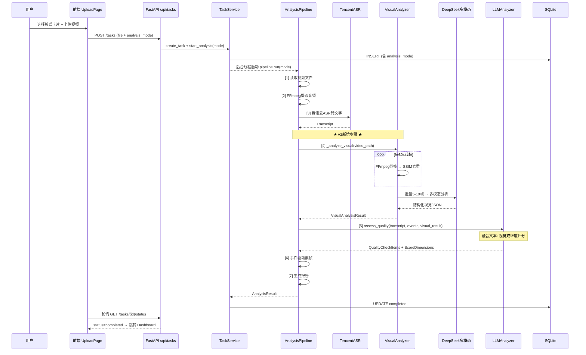
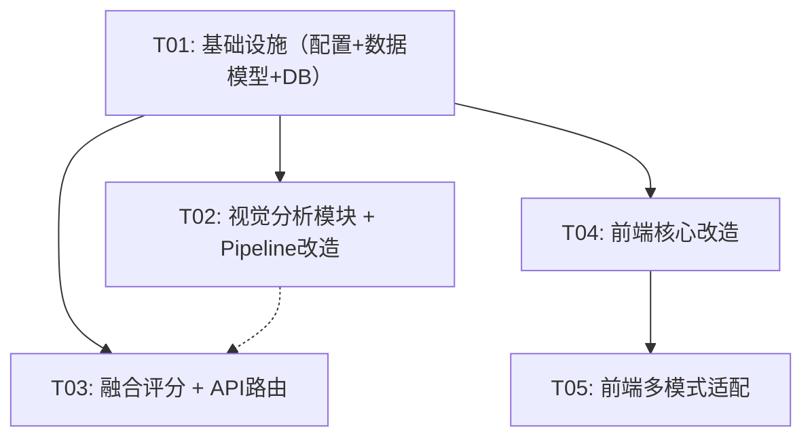
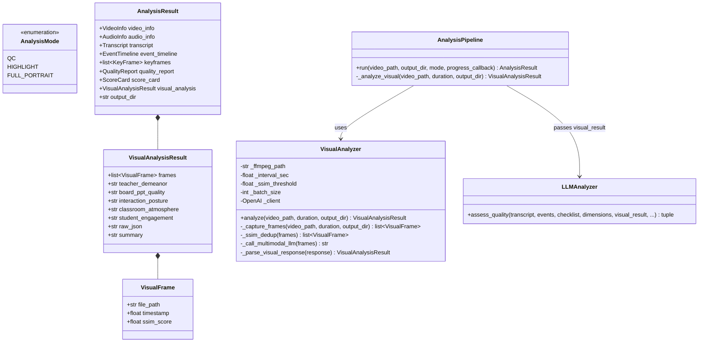

# 课堂视频分析工具 V2 — 增量架构设计

> Architect: 高见远 | 基于 V1 代码增量设计

---

## Part A: 系统设计

### 1. 实现方案概述

V2 核心增量：**三模式分析**（质检/评优/画像）+ **视觉理解管道**（30s定时截帧→SSIM去重→DeepSeek多模态→结构化视觉结论→与ASR文本融合评分）。

架构决策：视觉分析作为 Pipeline 第4步（`_analyze_visual`），插入在 ASR 转写与 LLM 语义分析之间。视觉结论作为并列输入传给 `LLMAnalyzer.assess_quality()`，由同一个 DeepSeek 模型完成融合评分。前端模式选择卡片替代班型下拉框，进度条从4阶段扩展为5阶段。

### 2. 新增/修改文件清单

| 文件 | 类型 | 职责 |
|------|------|------|
| `src/classroom_analyzer/analysis/visual_analyzer.py` | **新增** | 视觉分析器：定时截帧+SSIM去重+多模态LLM调用 |
| `src/classroom_analyzer/pipeline.py` | 修改 | Pipeline 6→7步，插入 `_analyze_visual`，传递 visual_result 到 evaluator |
| `src/classroom_analyzer/models.py` | 修改 | 新增 `AnalysisMode`, `VisualAnalysisResult`, `VisualFrame` dataclass |
| `src/classroom_analyzer/server/models.py` | 修改 | API 请求/响应增加 `analysis_mode`, `visual_summary` 字段 |
| `src/classroom_analyzer/server/database.py` | 修改 | tasks 表增加 `analysis_mode`, `visual_data` 列 |
| `src/classroom_analyzer/server/services.py` | 修改 | `_run_analysis_thread` 传递 mode，步骤映射 7→5阶段 |
| `src/classroom_analyzer/server/routers/tasks.py` | 修改 | POST /tasks 接受 `analysis_mode` 参数 |
| `src/classroom_analyzer/analysis/llm_analyzer.py` | 修改 | `assess_quality()` 增加 `visual_result` 参数，prompt 融合视觉维度 |
| `src/classroom_analyzer/config.py` | 修改 | `_merge_config` 支持视觉模型配置段 |
| `config/default.yaml` | 修改 | 新增 `visual` 配置段（截帧间隔/SSIM阈值/视觉模型） |
| `web/src/api/client.ts` | 修改 | 新增 `AnalysisMode` 类型，upload 传 mode |
| `web/src/pages/UploadPage.tsx` | 修改 | 班型下拉 → 三模式卡片选择 |
| `web/src/pages/AnalyzingPage.tsx` | 修改 | 状态轮询适配新 status type |
| `web/src/components/StepProgress.tsx` | 修改 | 4阶段→5阶段（新增"视频画面分析"） |
| `web/src/pages/DashboardPage.tsx` | 修改 | 新增视觉分析摘要面板 |
| `web/src/pages/ReportPage.tsx` | 修改 | 报告标题/结论随模式变化，含视觉分析小结 |
| `web/src/pages/HistoryPage.tsx` | 修改 | 列表增加"分析模式"标签列 |

### 3. 核心数据结构设计

#### 3.1 Python Dataclass（`models.py` 新增）

```python
from enum import Enum

class AnalysisMode(str, Enum):
    QC = "qc"              # 课中质检 — 严格按QC-v4标准
    HIGHLIGHT = "highlight" # 评优找亮点 — 侧重发现教学亮点
    FULL_PORTRAIT = "full_portrait"  # 全面画像 — 多维度综合分析

@dataclass
class VisualFrame:
    """单帧分析条目"""
    file_path: str          # 截帧图片路径
    timestamp: float        # 秒
    ssim_score: float = 1.0 # 与前帧相似度

@dataclass
class VisualAnalysisResult:
    """多模态视觉分析完整结果"""
    frames: list[VisualFrame] = field(default_factory=list)
    teacher_demeanor: str = ""       # 教师仪表教态
    board_ppt_quality: str = ""      # 板书/PPT质量
    interaction_posture: str = ""    # 师生互动姿态
    classroom_atmosphere: str = ""   # 课堂氛围
    student_engagement: str = ""     # 学生参与度
    raw_json: str = ""               # LLM原始JSON
    summary: str = ""                # 一句话视觉总结
```

`AnalysisResult` 新增字段：`visual_analysis: Optional[VisualAnalysisResult] = None`

#### 3.2 TypeScript 类型（`client.ts` 新增）

```typescript
export type AnalysisMode = 'qc' | 'highlight' | 'full_portrait';

export interface VisualSummary {
  teacher_demeanor: string;
  board_ppt_quality: string;
  interaction_posture: string;
  classroom_atmosphere: string;
  student_engagement: string;
  summary: string;
}
```

`TaskDetail` 新增：`analysis_mode?: AnalysisMode; visual_summary?: VisualSummary;`

#### 3.3 API 变更

**POST /api/tasks** 新增 Query 参数：
- `analysis_mode: str = "qc"` （qc/highlight/full_portrait）
- `level` 参数保留为可选（mode=qc 时默认 QC-v4）

**TaskDetailResponse** 新增字段：`analysis_mode: str = ""`

### 4. 关键调用流程



### 5. 新增依赖包

**Python (pip)**:
```
opencv-python-headless>=4.10.0  # SSIM计算（轻量）
```

**前端 (npm)**:
```
无新增（复用 MUI + recharts）
```

### 6. 任务列表

| Task | 涉及文件 | 职责 | 依赖 |
|------|---------|------|------|
| **T01** | `config/default.yaml`, `src/.../models.py`, `src/.../config.py`, `src/.../server/database.py`, `src/.../server/models.py` | 基础设施：YAML视觉配置段 + AnalysisMode枚举 + VisualAnalysisResult/VisualFrame数据类 + DB migration（analysis_mode/visual_data列） + API Schema扩展 | — |
| **T02** | `src/.../analysis/visual_analyzer.py`(新), `src/.../pipeline.py`, `src/.../server/services.py` | 视觉分析模块：定时截帧(30s)+SSIM去重+DeepSeek多模态调用+结构化解析；Pipeline插入第4步`_analyze_visual`；Services更新7步→5阶段映射 | T01 |
| **T03** | `src/.../analysis/llm_analyzer.py`, `src/.../server/routers/tasks.py`, `src/.../scorer.py` | 融合评分：`assess_quality()`增加`visual_result`参数，prompt模板含视觉维度；API路由接受`analysis_mode`；scorer适配新模式标题/结论 | T01 |
| **T04** | `web/src/api/client.ts`, `web/src/pages/UploadPage.tsx`, `web/src/components/StepProgress.tsx`, `web/src/pages/AnalyzingPage.tsx` | 前端核心改造：AnalysisMode类型+API适配；三模式卡片选择UI(替换班型下拉)；5阶段进度条；轮询适配新status | T01 |
| **T05** | `web/src/pages/DashboardPage.tsx`, `web/src/pages/ReportPage.tsx`, `web/src/pages/HistoryPage.tsx`, `web/src/App.tsx` | 前端多模式适配：Dashboard增加视觉分析摘要卡片；Report标题/结论模式感知；History列表增加模式标签Chip；移除班型选择UI残留 | T04 |

### 7. 任务依赖图



### 8. 共享知识

```
- 分析模式标识符：qc / highlight / full_portrait（贯穿前后端）
- 视觉分析模块路径：classroom_analyzer.analysis.visual_analyzer.VisualAnalyzer
- DeepSeek多模态模型：deepseek-chat（支持 vision，与文本同 API key）
- 截帧参数：interval_sec=30, ssim_threshold=0.85, batch_size=8
- Pipeline 7步骤：读取视频→提取音频→ASR转写→★视频理解→LLM语义分析→事件截帧→生成报告
- 前端5阶段：提取音频→语音识别→★视频画面分析→智能分析→生成报告
- 视觉prompt模板路径：prompts/visual_analysis.txt
- DB migration：ALTER TABLE tasks ADD COLUMN analysis_mode TEXT DEFAULT 'qc'; ALTER TABLE tasks ADD COLUMN visual_data TEXT;
- 所有模式共用 QC-v4 评分维度，但 prompt system message 随模式调整语气
```

### 9. 风险点和缓解

| 风险 | 缓解 |
|------|------|
| **DeepSeek多模态并发限制**：8帧/批 + 多轮评估可能触发 rate limit | `_call_llm` 已有指数退避重试(3次)；visual analyzer 复用同一 `_call_llm` 模式 |
| **SSIM去重精度 vs 性能**：opencv 的 SSIM 需解码全帧 | 先用 FFmpeg 缩略图(320px宽)再计算 SSIM，减少内存占用；`opencv-python-headless` 无 GUI 依赖 |
| **DB migration 兼容性**：已有 tasks.db 无 analysis_mode 列 | `init_db` 使用 `ALTER TABLE ADD COLUMN IF NOT EXISTS` 语法（SQLite 3.35+），或 try/except 忽略已存在错误 |

---

## Part B: 独立图表文件

### 类图


